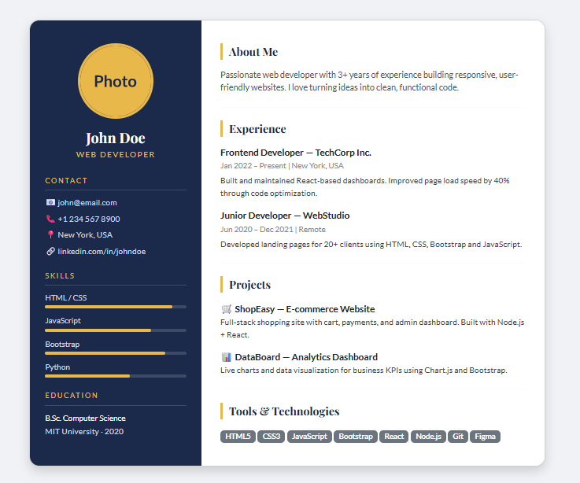

04BootstrapResumeDesign
Responsive Resume Website – Bootstrap Project
📘 About This Project

This project is a modern and responsive Resume Website.

It is created using:

HTML5

Bootstrap 5

Google Fonts

External CSS

There is no backend.
There is no database.

This project helps students understand how to build a professional resume layout using Bootstrap grid system.

🎯 What Students Will Learn

After completing this project, students will understand:

Basic HTML page structure

How to use Bootstrap CDN

How Bootstrap Grid system works

How to create responsive columns

How to design sidebar layout

How to use Bootstrap utility classes

How to add Google Fonts

How to link external CSS file

How to create modern resume UI

🖥 Design Features

This design includes:

Two column resume layout

Left sidebar profile section

Right main content section

Responsive Bootstrap grid

Skills progress bars

Badge style skills

Professional typography using Google Fonts

Clean card layout

Mobile responsive design

🔷 How Bootstrap Is Added (Using W3Schools Method)

Bootstrap is added using CDN link inside the <head> section.

Step 1: Copy Bootstrap CDN from W3Schools

Visit:
https://www.w3schools.com/bootstrap5/

Copy the CSS CDN link.

Step 2: Paste Inside <head>
<link href="https://cdn.jsdelivr.net/npm/bootstrap@5.3.2/dist/css/bootstrap.min.css" rel="stylesheet">

This connects Bootstrap framework to your project.

Now you can use:

container

row

col-md-4

col-md-8

card

badge

shadow

mt-4

and many more Bootstrap classes

🔷 How Bootstrap Grid Works

Bootstrap layout is created using:

container → row → column

Example used in this project:

    

        
Left Sidebar

        
Right Content

    

Explanation:

container → Main wrapper

row → Horizontal layout

col-md-4 → 4 columns width

col-md-8 → 8 columns width

Total = 12 columns (Bootstrap rule)

🔷 How Google Fonts Are Added

Google Fonts are added inside <head>.

Step 1: Go to Google Fonts

https://fonts.google.com/

Step 2: Select Fonts (Example: Lato & Playfair Display)
Step 3: Copy link and paste inside <head>
<link href="https://fonts.googleapis.com/css2?family=Lato:wght@300;400;700&family=Playfair+Display:wght@700&display=swap" rel="stylesheet">
Step 4: Use Font in CSS
body {
    font-family: 'Lato', sans-serif;
}
🔷 How External CSS Is Added

External CSS is connected using <link> tag.

<link rel="stylesheet" href="wwwroot/CSS/StyleSheet.css">
Explanation:

rel="stylesheet" → tells browser this is CSS

href="StyleSheet.css" → path of CSS file

Both HTML and CSS files must be correctly linked.

🔷 Bootstrap Classes Used
| Class       | Purpose             |
| ----------- | ------------------- |
| `container` | Main wrapper        |
| `row`       | Horizontal layout   |
| `col-md-4`  | Sidebar width       |
| `col-md-8`  | Main content width  |
| `card`      | Card layout         |
| `shadow`    | Box shadow effect   |
| `mt-4`      | Margin top spacing  |
| `badge`     | Skill label styling |
| `g-0`       | Remove column gap   |

🔷 HTML Tags Used

| Tag       | Purpose                     |
| --------- | --------------------------- |
| `<html>`  | Root element of the page    |
| `<head>`  | Metadata and external links |
| `<title>` | Browser tab title           |
| `<link>`  | Connect external CSS file   |
| `<body>`  | Visible webpage content     |
| `
`   | Layout sections             |
| ``   | Profile image               |
| `
`     | Paragraph text              |
| ``  | Inline elements             |
| `
`    | Horizontal line separator   |

🚀 How to Add and Run Using Visual Studio

Open Visual Studio.

Create New Project → Empty Project.

Right click project → Add → New Item → HTML Page.

Name it index.html.

Right click project → Add → New Item → Style Sheet.

Name it StyleSheet.css.

Add Bootstrap CDN inside <head>.

Add Google Fonts link.

Link your external CSS file.

Paste HTML code.

Paste CSS code.

Save all files.

Right click project → Open Folder in File Explorer.

Double click index.html to open in browser.

📱 Responsive Behavior

On Desktop → Two columns side by side

On Tablet → Adjusted width

On Mobile → Columns stack vertically

Bootstrap automatically handles responsiveness.

📸 Output

Add your screenshot image inside project folder.

Example:

💡 Purpose of This Project

This project is created for learning Bootstrap and responsive design.

